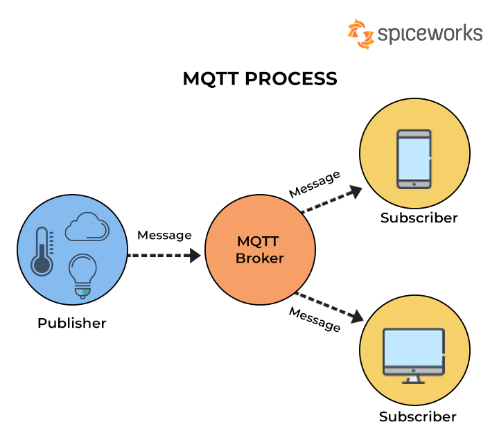

# MQTT PROCESS

 
# Library include : 
Sketch -> Include Library -> Manage Libraries... -> Type PubSubClient(Nick O'Leary) in Search field -> Install.
# Create Broker 
``` https://github.com/alligator609/MQTT ``` 
# to test from outside add MQTT Clint app in chrome browser
``` https://chrome.google.com/webstore/detail/mqttlens/hemojaaeigabkbcookmlgmdigohjobjm/related?hl=en ```
