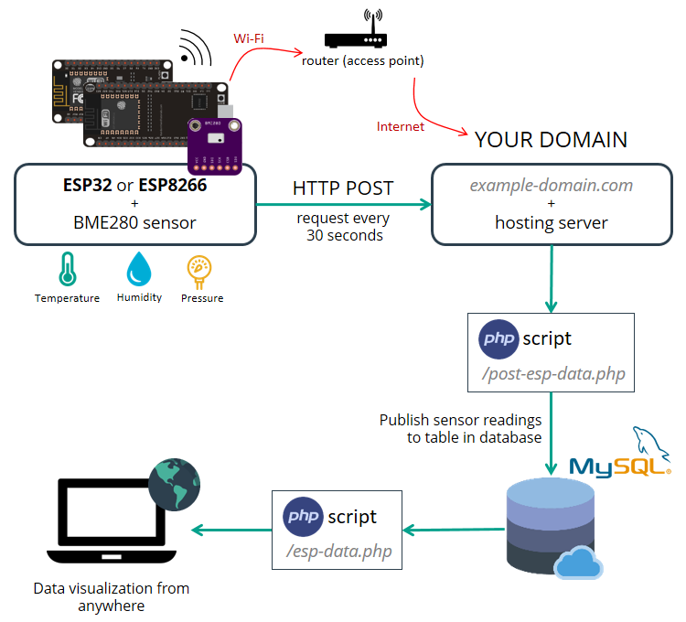

1. Total overview
 
2. Create a database u can use laragon/xampp  
3. careate a table sql query 
```
CREATE TABLE SensorData (
    id INT(6) UNSIGNED AUTO_INCREMENT PRIMARY KEY,
    sensor VARCHAR(30) NOT NULL,
    location VARCHAR(30) NOT NULL,
    value1 VARCHAR(10),
    value2 VARCHAR(10),
    value3 VARCHAR(10),
    reading_time TIMESTAMP DEFAULT CURRENT_TIMESTAMP ON UPDATE CURRENT_TIMESTAMP
) 
```
4. 


# note
``` https://randomnerdtutorials.com/esp32-esp8266-mysql-database-php/ ```